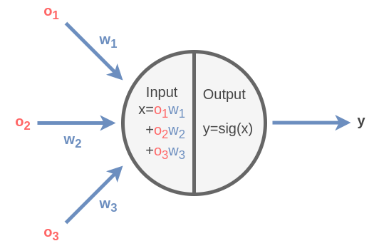
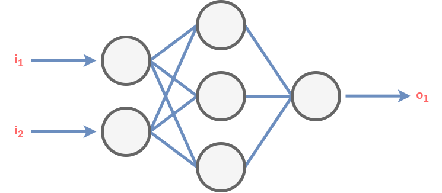

[](https://maven.apache.org/)
[](https://adoptium.net/de/temurin/releases/?os=linux&arch=any&package=jdk)

# Simple Neural Network

A simple neural network which can be trained and tested with the MNIST data set.
The MNIST data set is split into a training set and a testing set.

## MNIST data sets

The MNIST data sets can be found here: https://pjreddie.com/projects/mnist-in-csv/

The original data sets are here: http://yann.lecun.com/exdb/mnist/

There is also a number of others who present their results there.

## Run

To run the project, it must be build first:

```bash
cd simple-neural-network/
mvn clean verify
```

After building the project the artifact is under _target/_. It can be used as follows:

| Argument  | Description                                                                                                                                 | Example                         |
|-----------|---------------------------------------------------------------------------------------------------------------------------------------------|---------------------------------|
| `--help`  | Print this help menu.                                                                                                                       | `--help`                        |
| `--train` | Train the net with the training data set.                                                                                                   | `--train /path/mnist_train.csv` |
| `--test`  | Test the net with the test data set.                                                                                                        | `--test /path/mnist_test.csv`   |
| `--layer` | To create a new net, specify the layer sizes.<br>For the MNIST data sets the first layer has to<br>have 784 and the last layer 10 elements. | `--layer 784,200,10`            |
| `--save`  | Save the net in a file. The file must not exist.                                                                                            | `--save /path/save_net`         |
| `--load`  | Load the net from a file.                                                                                                                   | `--load /path/save_net`         |
| `--lr`    | The learning rate.                                                                                                                          | `--lr 0.01`                     |

The arguments must come on pairs:

| Pair                                | Description                          |
|-------------------------------------|--------------------------------------|
| `--layer` `--train` `--lr` `--save` | Create a new net, train and save it. |
| `--load` `--train` `--lr` `--save`  | Load a net, train and save it.       |
| `--layer` `--test`                  | Create a new net and test it.        |
| `--load` `--test`                   | Load a net and test it.              |

Examples how to train and test the net can be found under _assets/_.

## How the net works

The net is made up of neurons:



Where $sig(x)$ is a sigmoid function, a function with a S-shaped graph:

```math
sig(x)= {1 \over 1 + e^{-x}}
```

The net consists of layers where every layer is made up of neurons.
Every neuron is connected to every neuron in the next layer:



The input is propagated through net by multiplying the output of a layer with the weights between the layers.
The output of the input layer is equals to the input, the output of the following layers is put into the sigmoid
function before passed to the next layer.

To make the net learn, the output is subtracted from the target values. Then the error is propagated back through the
net:

```math
\Delta w_{jk} = \alpha \cdot E_b \cdot O_b (1 - O_b) \cdot O_a^T
```

The learning rate is multiplied by the error, the differentiated sigmoid function and the transposed matrix of the
previous layer output.

All this is implemented in the class Net in the methods run and backpropagate.
The rest is boilerplate to read arguments passed to programm, to read the MNIST data sets and run and train the net.
